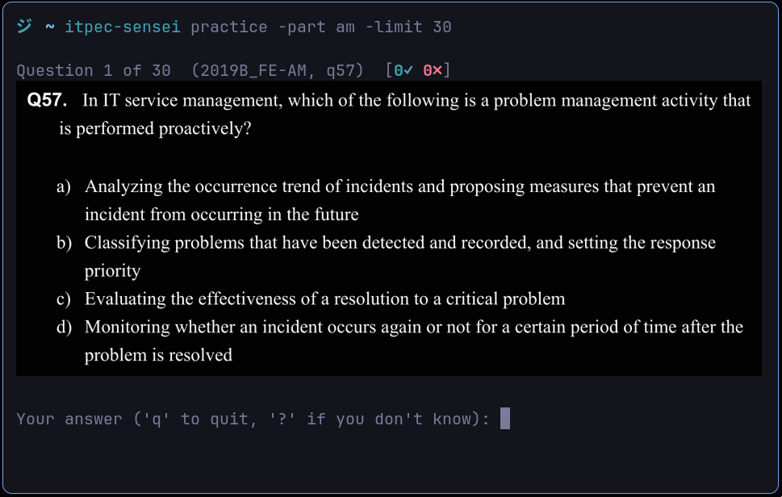

# itpec-sensei

A local-first CLI for practicing ITPEC exam questions (Fundamental IT Engineer / IT
Passport) — study standalone from the terminal, or hand it to any MCP-compatible AI
assistant (Claude Code, Codex CLI, or any other) to run a practice session through chat.



## Features

- Timed practice sessions with per-question or whole-session limits
- Review mode (revisit questions you got wrong) and weak-topic-weighted mode
- Progress tracking: streaks, per-topic/per-exam accuracy, activity heatmap — stored locally
- MCP server so an AI assistant can run practice sessions with you conversationally

## Installation

### Run with Nix

    nix run github:jim-ww/itpec-sensei

or add it to your profile / flake inputs and run `itpec-sensei` directly:

```nix
{
  inputs.itpec-sensei.url = "github:jim-ww/itpec-sensei";
  # then reference inputs.itpec-sensei.packages.${system}.default
}
```

### From source

    go install github.com/jim-ww/itpec-sensei@latest

On first run, itpec-sensei asks for consent to download the question bank
(~350MB) from this repo's GitHub releases into your local data directory. Run
`itpec-sensei data` any time to check for and pull updates.

## CLI Usage

    itpec-sensei

Show progress summary: streaks, review-queue count, per-topic/per-exam accuracy.

    itpec-sensei practice
    itpec-sensei practice --part am --limit 5   # practice 5 FE questions (Morning part)
    itpec-sensei practice --exam 2025A_FE-A --order sequential --time-limit 90m   # simulate the real exam, in order, under a time limit
    itpec-sensei practice --topic "Databases" --limit 10   # drill just one topic

Start a practice session — default, a quick drill, or a full timed mock exam.

    itpec-sensei sessions --incomplete
    itpec-sensei practice --continue      # resume the most recent not-completed session, exactly where it left off
    itpec-sensei practice --continue=42   # resume session 42 specifically
    itpec-sensei practice --repeat 42     # start a new session with the same exam/topic/mode/limits as session 42

List sessions that never finished cleanly, then resume or repeat one.

    itpec-sensei sessions --delete 42

Permanently delete a session and its attempts (prompts for confirmation; pass `--yes` to skip it).

    itpec-sensei topics

List all known topics (valid values for `--topic`).

    itpec-sensei history
    itpec-sensei sessions

List past individual answers, or past practice sessions.

Run `itpec-sensei <command> --help` for the full flag list on any subcommand.

## MCP Server

Lets an AI assistant fetch questions, submit your answers, and read your progress —
grading always happens locally, the AI just relays what you say.

### Local (stdio)

For Claude Code:

    claude mcp add --transport stdio --scope user itpec-sensei -- itpec-sensei serve

### Remote (via ngrok)

For AI clients that can't spawn a local process (e.g. browser-based chat), expose the
server through an ngrok tunnel:

    NGROK_AUTHTOKEN=<your-ngrok-token> NGROK_RESERVED_URL=<your-ngrok-reserved-url> itpec-sensei serve --ngrok --remote

Get an authtoken at https://dashboard.ngrok.com/get-started/your-authtoken.
`NGROK_RESERVED_URL` is optional, but pins the tunnel to a fixed domain so your
client's configured URL doesn't change every time you restart the server.

## Support

If itpec-sensei helped you pass, a coffee's always appreciated:

**Monero (XMR)**
```
83YGRqP8uHed6NeegZQeX9ccCxbzoRHHEEi7pTwk4aqdJZEVXXA6NWtetnsEM2v33zFBBt3Rp6DNhU9qhJEGPspU14yN8t7
```

## License

[AGPLv3](LICENSE). Free to use, study, share, and modify — provided you keep the same freedoms for others.
